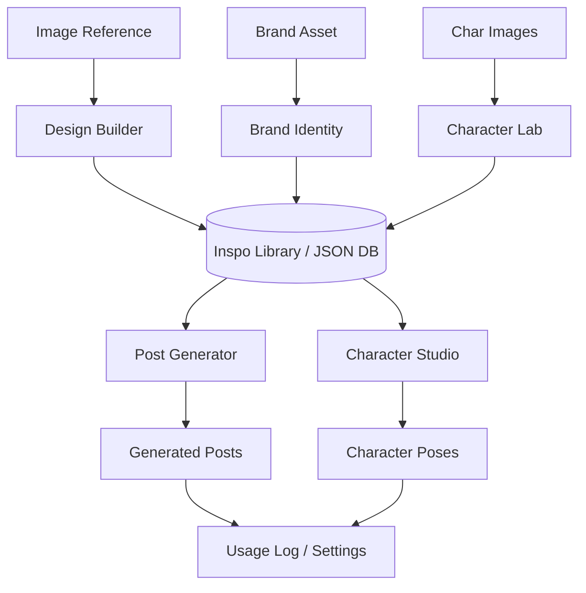

# PRD: Weed Labs (CreativeWeedLabs) 🌿

## 1. 📋 Executive Summary
**Weed Labs** is a production-grade AI laboratory designed to deconstruct design assets into their core "DNA" and recombine them to generate high-fidelity, consistent creative content. The platform serves as a high-tech bridge between static design inspiration and dynamic, brand-compliant AI generation.

---

## 2. 🎯 Product Objectives
- **Precision Extraction**: Extract structural and visual logic from any design reference with clinical accuracy.
- **Brand Guardrails**: Maintain 100% brand consistency using a dedicated Brand DNA extraction system.
- **Identity Lock**: Ensure character identity parity across multiple poses and scenes using advanced visual anchoring.
- **Modular Deployment**: Automate the generation of social media assets through a modular template engine.

---

## 3. 🧬 Core Feature Bundles

The system is organized into specialized "Labs" that extract distinct DNA strands, which are later synthesized in the generation phase.

### 🧪 3.1 Design Builder (`Builder.tsx`)
- **Purpose**: Deconstructs social media posts or complex designs into modular rules.
- **Output**: `Design DNA` (Structural rules, layout archetype, typography system, and composition maps).
- **Gemini Interaction**:
    - **Prompt**: "You are a World-Class Creative Director... Task: Deconstruct the provided social media post into its modular 'Design DNA'..."
    - **Variables**: `imageB64`, `userNotes`.
    - **Model**: `gemini-3-flash-preview` (Text).

### 🎨 3.2 Brand Identity Lab (`BrandLab.tsx`)
- **Purpose**: Extracts brand-specific visual rules from logos, assets, or style guides.
- **Output**: `Brand DNA` (Color palette, brand vibe, typography notes).
- **Gemini Interaction**:
    - **Prompt**: "Analyze this brand asset. Extract Brand DNA. Return ONLY a JSON object..."
    - **Variables**: `imageB64`.
    - **Model**: `gemini-3-flash-preview` (Text).

### 🎭 3.4 Character Lab (`CharacterLab.tsx`)
- **Purpose**: Consolidates character identity and physical features from multiple source images.
- **Gemini Interaction (Analysis)**:
    - **Prompt**: "You are an expert Character Designer. Analyze the provided images to extract a consistent CHARACTER DNA profile..."
    - **Variables**: `imagesB64[]`.
    - **Model**: `gemini-3-flash-preview` (Text).

### 🏛️ 3.5 Generator (`Generator.tsx` & `CarouselGenerator.tsx`)
This is the core recombination engine. To solve "Generation Entropy", it uses a **Hybrid Anchor Strategy** (Visual Anchor + Text DNA).

#### 3.5.1 Deployment Engine (High Fidelity)
- **Strategy**: Prioritizes strict visual adhearance to the source image (Blueprint) to prevent layout drift.
- **Gemini Interaction**:
    - **Prompt Construction**:
        ```
        VISUAL REFERENCE: Use the provided image (Image 1) as the STRUCTURAL and AESTHETIC SOURCE OF TRUTH. Mimic its layout, spacing, and vibe exactly.

        Create a new post remix. 
        SOURCE DNA: {JSON_DNA_FROM_BUILDER}
        NEW BRIEF: {USER_BRIEF}
        BRAND RULES: {BRAND_DNA_JSON}
        CHARACTER DNA: {CHARACTER_DNA_LITE}
        
        INTENSITY: {INTENSITY_LEVEL}
        
        THEME ADAPTATION RULES: {THEME_RULES}
        
        COPY RULES:
        - Must include specific text: "{BRIEF_COPY}"
        ```
    - **Attachments**:
        1.  `Blueprint Original Image` (Visual Anchor).
        2.  `Character Reference Image` (If character selected).
    - **Model**: `gemini-3-flash-preview` (for Prompt Logic) -> `gemini-3-pro-image-preview` (for Final Render).

### 📸 3.6 Character Studio (`CharacterStudio.tsx`)
- **Purpose**: Generates consistent poses for a specific character.
- **Gemini Interaction**:
    - **Prompt**:
        ```
        CHARACTER SPECIFICATIONS:
        - Name: {CHAR_NAME}
        - Physical Features: {CHAR_DESC}
        - Color Palette: {HEX_CODES}
        
        IDENTITY LOCK: Maintain 100% character consistency. Use the provided Character Reference image as the source of truth.
        
        POSE INSTRUCTION: {POSE_PROMPT} or "Sync with Reference Pose Image".
        ```
    - **Attachments**:
        1.  `Character Primary Reference` (Identity Anchor).
        2.  `Pose Reference Image` (Optional - Structure Anchor).
    - **Model**: `gemini-3-pro-image-preview`.

---

## 4. 📝 User Stories & Acceptance Criteria

| User Story (As a... I want... So that...) | Acceptance Criteria (Gherkin) | Description |
| :--- | :--- | :--- |
| **As a** content creator, **I want** to extract the structural DNA of a design reference, **so that** I can reuse its layout logic for new content. | **Given** a reference image with a specific layout<br>**When** I upload it to the Design Builder<br>**Then** the system should identify the archetype, typography system, and composition map<br>**And** save it as a `DesignReference`. | Extends the ability to "copy" the structural vibe of a post without copying the pixels. |
| **As a** brand manager, **I want** to capture my brand's color logic and vibe from a logo, **so that** I can ensure all generated content remains on-brand. | **Given** a brand asset image<br>**When** I process it in the Brand Lab<br>**Then** the system should extract primary hex codes and brand vibe notes<br>**And** allow me to save it as a `BrandReference`. | Essential for maintaining visual parity across different generation modules. |
| **As a** character designer, **I want** to consolidate my character's physical identity and lock it, **so that** I can transform its style without losing its facial soul. | **Given** multiple photos of the same character<br>**When** I analyze them in the Character Lab and select a "Plushy" style<br>**Then** the system should generate a `CharacterDNA` and a turnaround sheet where the character is a plush toy but maintains its original identity.<br>**And** the system should store the "Identity Lock" as a permanent state. | Focuses on multi-image synthesis and style transformation without identity drift. |
| **As a** social media manager, **I want** to combine a layout blueprint with my brand DNA and new copy, **so that** I can quickly produce high-quality, customized social posts. | **Given** a saved `DesignReference` and `BrandReference`<br>**When** I provide a content brief in the Post Generator<br>**Then** the system should generate a new high-fidelity image that respects both the layout DNA and the brand's visual rules. | The core recombination engine of the Production Lab. |

---

## 🚀 5. Technical Architecture

### 🛠️ 5.1 Tech Stack
- **Frontend**: React (v19), Vite, TypeScript, Tailwind CSS.
- **Backend (Hybrid)**: 
    - **Local**: Express.js server for filesystem storage (`/database/*.json`).
    - **Cloud/Fallback**: `storageService` adapter for Browser LocalStorage (Serverless support).
- **AI Engine**: 
  - `gemini-3-flash-preview`: For rapid DNA extraction and logical analysis.
  - `gemini-3-pro-image-preview`: For photorealistic image generation and surgical refinement.

### 📊 5.2 Data Pipeline


---

## 🧪 6. Persistence & Infrastructure
- **Data Storage**: Hybrid (FileSystem JSON or LocalStorage).
- **Cost Tracking**: Integrated `UsageLog` tracking USD/IDR conversion for Gemini API calls.
- **Deployment**: Supports Vercel (Serverless) or VPS (Node.js).

---

## 📦 7. Target Assets
- **Design DNA**: Structural blueprints for layout replication.
- **Brand DNA**: Style guidelines for visual consistency.
- **Character DNA**: Identity rules for character-led storytelling.
- **Final Outputs**: High-resolution PNGs, character sheets, and personalized branding assets.
