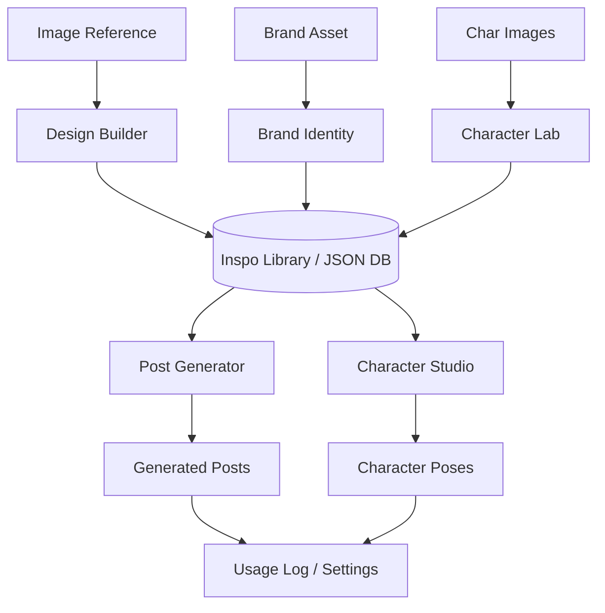

# PRD: Weed Labs (CreativeWeedLabs) 🌿

## 1. 📋 Executive Summary
**Weed Labs** is a production-grade AI laboratory designed to deconstruct design assets into their core "DNA" and recombine them to generate high-fidelity, consistent creative content. The platform serves as a high-tech bridge between static design inspiration and dynamic, brand-compliant AI generation.

---

## 2. 🎯 Product Objectives
- **Precision Extraction**: Extract structural and visual logic from any design reference with clinical accuracy.
- **Brand Guardrails**: Maintain 100% brand consistency using a dedicated Brand DNA extraction system.
- **Identity Lock**: Ensure character identity parity across multiple poses and scenes using advanced visual anchoring.
- **Modular Deployment**: Automate the generation of social media assets through a modular template engine.

---

## 3. 🧬 Core Feature Bundles

The system is organized into specialized "Labs" that extract distinct DNA strands, which are later synthesized in the generation phase.

### 🧪 3.1 Design Builder (`Builder.tsx`)
- **Purpose**: Deconstructs social media posts or complex designs into modular rules.
- **Output**: `Design DNA` (Structural rules, layout archetype, typography system, and composition maps).
- **Connection**: Stores a `DesignReference`. This serves as the **layout blueprint** for the Post Generator.

### 🎨 3.2 Brand Identity Lab (`BrandLab.tsx`)
- **Purpose**: Extracts brand-specific visual rules from logos, assets, or style guides.
- **Output**: `Brand DNA` (Color palette, brand vibe, typography notes).
- **Connection**: Stores a `BrandReference`. This acts as a **visual skin** that can be applied to any layout blueprint.

### 🍱 3.3 Carousel Generator (`CarouselGenerator.tsx`)
- **Purpose**: A production line for multi-slide content.
- **Function**: Allows users to define headlines and visual nuances for each slide while inheriting the universal Design DNA from a blueprint.
- **Character Slotting**: Detects if a blueprint expects a character and allows "injecting" a Character DNA into every slide.

### 🎭 3.4 Character Lab & Studio (`CharacterLab.tsx`)
- **Purpose**: Consolidates character identity and physical features from multiple source images.
- **V2 Upgrade**:
    - **Identity Lock**: Implements strict visual anchoring to prevent "figure drift" during generation. 100% fidelity to the original facial features.
    - **Style Remixing**: Ready-to-use modes (Plushy, Chibi, Animated, etc.) transform realistic images into stylized versions while preserving core identity.
    - **Brand DNA Link**: Characters can be associated with Brand DNA to inherit color logic and brand personality.
- **Output**: `Character DNA` (Physical features, visual details, strict color palettes, and Identity Lock state).
- **Connection**: Provides the **identity anchor** for the Character Studio and **Deployment Engine** (Post/Carousel Generators).

### 🏛️ 3.5 Inspo Library (`Library.tsx`)
- **Purpose**: The central "Vault" and management hub.
- **Function**: Manages all saved DNA references and generated assets. It allows users to browse, update, and manage their creative laboratory's history. Updated to support **Carousel saving**.

---

## 4. 📝 User Stories & Acceptance Criteria

| User Story (As a... I want... So that...) | Acceptance Criteria (Gherkin) | Description |
| :--- | :--- | :--- |
| **As a** content creator, **I want** to extract the structural DNA of a design reference, **so that** I can reuse its layout logic for new content. | **Given** a reference image with a specific layout **When** I upload it to the Design Builder **Then** the system should identify the archetype, typography system, and composition map **And** save it as a `DesignReference`. | Extends the ability to "copy" the structural vibe of a post without copying the pixels. |
| **As a** brand manager, **I want** to capture my brand's color logic and vibe from a logo, **so that** I can ensure all generated content remains on-brand. | **Given** a brand asset image **When** I process it in the Brand Lab **Then** the system should extract primary hex codes and brand vibe notes **And** allow me to save it as a `BrandReference`. | Essential for maintaining visual parity across different generation modules. |
| **As a** character designer, **I want** to consolidate my character's physical identity and lock it, **so that** I can transform its style without losing its facial soul. | **Given** multiple photos of the same character **When** I analyze them in the Character Lab and select a "Plushy" style **Then** the system should generate a `CharacterDNA` and a turnaround sheet where the character is a plush toy but maintains its original identity. **And** the system should store the "Identity Lock" as a permanent state. | Focuses on multi-image synthesis and style transformation without identity drift. |
| **As a** social media manager, **I want** to combine a layout blueprint with my brand DNA and new copy, **so that** I can quickly produce high-quality, customized social posts. | **Given** a saved `DesignReference` and `BrandReference` **When** I provide a content brief in the Post Generator **Then** the system should generate a new high-fidelity image that respects both the layout DNA and the brand's visual rules. | The core recombination engine of the Production Lab. |
| **As a** campaign manager, **I want** to build a multi-slide carousel from a single blueprint with character consistency, **so that** I can tell a story across slides. | **Given** a `DesignReference` with a character slot **When** I provide multi-slide briefs and a `CharacterDNA` in the Carousel Generator **Then** the system should output a sequence of cohesive slides featuring the character. | Enables storytelling with identity consistency across assets. |
| **As a** character designer, **I want** to pose my consistent character using a reference image or text prompt, **so that** I can create dynamic scenes for my brand storytelling. | **Given** a `CharacterDNA` profile **When** I provide a pose reference image or text instruction in the Character Studio **Then** the system should output a new image of the exact same character in the desired pose using visual anchoring. | Critical for "Visual Parity"—ensuring the character doesn't "drift" between generations. |

---

## 🚀 5. Technical Architecture

### 🛠️ 5.1 Tech Stack
- **Frontend**: React (v19), Vite, TypeScript, Tailwind CSS.
- **Backend**: Express.js (Local production storage server).
- **AI Engine**: 
  - `gemini-3-flash-preview`: For rapid DNA extraction and logical analysis.
  - `gemini-3-pro-image-preview`: For photorealistic image generation and surgical refinement.

### 📊 5.2 Data Pipeline

---

## 🧪 6. Persistence & Infrastructure
- **Data Storage**: `/database/*.json`
- **Cost Tracking**: Integrated `UsageLog` tracking USD/IDR conversion for Gemini API calls.
- **Security**: Supports both `.env` managed keys and session-based manual key overrides.

---

## 📦 7. Target Assets
- **Design DNA**: Structural blueprints for layout replication.
- **Brand DNA**: Style guidelines for visual consistency.
- **Character DNA**: Identity rules for character-led storytelling.
- **Final Outputs**: High-resolution PNGs, character sheets, and personalized branding assets.
