# Creative Powerhouse UX Audit
> **For Daily Content Creators** | Comprehensive Flow Analysis

---

## Executive Summary

This audit evaluates Creative Powerhouse ("Weed Labs") from the perspective of a **content creator who posts daily**. While the platform offers powerful DNA extraction and generation capabilities, the current UX presents several friction points that slow down the daily content production workflow.

### Key Findings

| Area | Verdict | Impact on Daily Use |
|------|---------|---------------------|
| **Onboarding** | ⚠️ Missing | Users must discover features through trial and error |
| **Daily Workflow** | ⚠️ Fragmented | Requires navigating 4-5 screens for one post |
| **Asset Reusability** | ✅ Good | Presets and saved DNA work well |
| **Batch Production** | ⚠️ Limited | Only in Generator (Batch) and Carousel |
| **Quick Access** | ⚠️ Missing | No "Quick Post" shortcut from home |

---

## Feature-by-Feature Audit

---

## 1. Brand Lab

### Purpose
Extract and save "Brand DNA" (colors, vibe, constraints) from brand assets for consistent generation.

### Current Flow
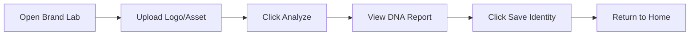

| Step | Clicks | Friction |
|------|--------|----------|
| 1. Navigate to Brand Lab | 1 | Low |
| 2. Upload image | 2 | Low - drag or click |
| 3. Analyze | 1 | Medium - wait for AI |
| 4. Review results | 0 | Low |
| 5. Save | 1 | Low |
| **Total** | **5** | |

### UX Verdict: ✅ **Good for Setup**
- **Strengths**: Simple linear flow, clear feedback, visual DNA report
- **Pain Points**: 
  - No ability to edit DNA after extraction
  - Cannot batch-upload multiple brand assets
  - Must return to home after save

### Ideal Flow
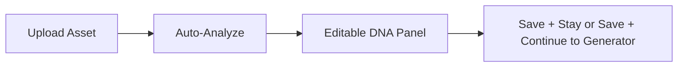

**Recommendation**: Add "Save & Go to Generator" shortcut, editable DNA fields.

---

## 2. Character Lab

### Purpose
Extract consistent "Character DNA" from photos for character-based content generation.

### Current Flow
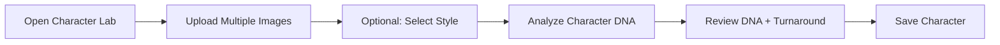

| Step | Clicks | Friction |
|------|--------|----------|
| 1. Navigate | 1 | Low |
| 2. Upload images (multi) | 2+ | Medium - one at a time |
| 3. Select style (optional) | 1 | Low |
| 4. Analyze | 1 | Medium - long wait |
| 5. Review DNA sections | 0 | Low |
| 6. Save | 1 | Low |
| **Total** | **6+** | |

### UX Verdict: ⚠️ **Good but Slow**
- **Strengths**: Multi-image support, style options, DNA editing
- **Pain Points**:
  - Image upload is one-by-one (no batch drop)
  - "Evolve with Brand" feature is hidden
  - Long processing time with no progress indicator
  - History dropdown for existing characters is easy to miss

### Ideal Flow
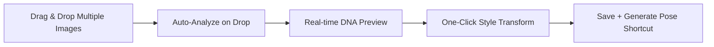

**Recommendation**: Batch image drop, progressive DNA preview, visible progress bar.

---

## 3. Design Builder

### Purpose
Extract "Design DNA" (layout rules, typography, composition) from reference posts.

### Current Flow
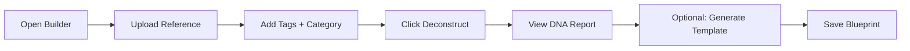

| Step | Clicks | Friction |
|------|--------|----------|
| 1. Navigate | 1 | Low |
| 2. Upload | 2 | Low |
| 3. Add tags | 1-5 | Medium - manual entry |
| 4. Select category | 1 | Low |
| 5. Deconstruct | 1 | Medium - wait |
| 6. Review DNA | 0 | Low |
| 7. Generate template (optional) | 1 | Medium - extra wait |
| 8. Save | 1 | Low |
| **Total** | **8-12** | |

### UX Verdict: ⚠️ **Feature-Rich but Tedious**
- **Strengths**: Detailed DNA extraction, template preview, tagging system
- **Pain Points**:
  - Tags are added one-by-one
  - Category selection before analysis feels backward
  - Template generation is separate step
  - DNA report is long, no summary view

### Ideal Flow
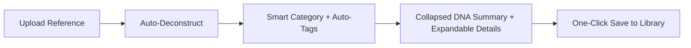

**Recommendation**: Auto-categorization, smart tags, collapsed DNA summary.

---

## 4. Post Generator

### Purpose
The core production tool—combine DNA assets to generate single posts.

### Current Flow — Library Mode (Primary)
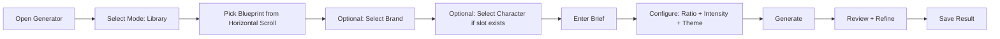

| Step | Clicks/Actions | Friction |
|------|----------------|----------|
| 1. Navigate | 1 | Low |
| 2. Select mode | 1 | Low |
| 3. Pick blueprint | 1-5 (scrolling) | Medium |
| 4. Select brand | 1-3 | Low |
| 5. Select character | 0-2 | Low (conditional) |
| 6. Enter brief | 1 + typing | Low |
| 7. Configure settings | 2-4 | Medium - hidden options |
| 8. Generate | 1 | High - wait time |
| 9. Review | 0 | Low |
| 10. Refine (optional) | 2+ | Medium |
| 11. Save | 1 | Low |
| **Total** | **11-20** | |

### Current Flow — Quick Mode
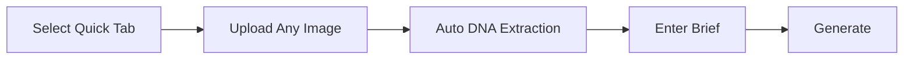

**Quick Mode is faster (5-6 steps)** but loses the DNA library advantage.

### Current Flow — Batch Mode
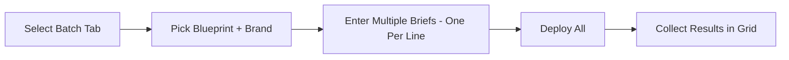

### UX Verdict: ⚠️ **Powerful but Overwhelming**
- **Strengths**: Multiple modes, presets, precision mode, refinement loop
- **Pain Points**:
  - Blueprint picker is horizontal scroll with tiny thumbnails
  - Mode selection (Quick/Library/Batch) adds cognitive load
  - Settings (ratio, intensity, theme, model) scattered across UI
  - No "Regenerate" button—must re-enter settings
  - Saved presets only work in Library mode
  - **Character slot detection is reactive** (shows only after blueprint selected)

### Ideal Flow (Daily Creator Optimized)
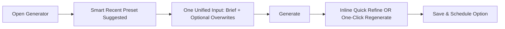

**Recommendation**: 
1. Default to last-used preset
2. Unified brief input (move DNA selection to sidebar)
3. Add "Regenerate" button
4. Add "Save & Schedule" for publishing flow

---

## 5. Carousel Generator

### Purpose
Batch-generate multi-slide carousels from a single brief.

### Current Flow
```mermaid
graph LR
A[Open Carousel Generator] --> B[Select Blueprint + Brand + Character]
B --> C[Enter Carousel Name]
C --> D[Write Single Brief for All Slides]
D --> E[Select Slide Count: 3/5/7/10]
E --> F[Plan & Generate]
F --> G[AI Plans Slides]
G --> H[Sequential Image Generation]
H --> I[Review in Filmstrip]
I --> J[Save or Download ZIP]
```

| Step | Clicks/Actions | Friction |
|------|----------------|----------|
| 1. Navigate | 1 | Low |
| 2. Configure DNA | 3 dropdowns | Medium |
| 3. Name carousel | 1 + typing | Low |
| 4. Write brief | 1 + typing | Low |
| 5. Select count | 1 | Low |
| 6. Generate | 1 | Low |
| 7. Wait for planning | 0 | Low |
| 8. Wait for generation | 0 | High - long sequential wait |
| 9. Review slides | 0-N | Low |
| 10. Save/Download | 1 | Low |
| **Total** | **~10** | |

### UX Verdict: ✅ **Well-Designed for Batch**
- **Strengths**: 
  - Single brief → multiple slides (excellent UX)
  - AI planning step visible to user
  - Filmstrip preview during generation
  - ZIP download option
- **Pain Points**:
  - Cannot edit individual slide briefs after planning
  - No pause/cancel during generation
  - Aspect ratio locked after starting
  - Cannot reorder slides

### Ideal Flow
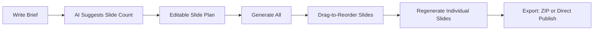

**Recommendation**: Editable slide plan, regenerate per-slide, reorder option.

---

## 6. Character Studio

### Purpose
Generate consistent character poses using saved Character DNA.

### Current Flow
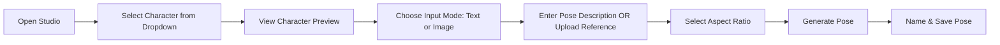

| Step | Clicks | Friction |
|------|--------|----------|
| 1. Navigate | 1 | Low |
| 2. Select character | 1 | Low |
| 3. Review DNA | 0 | Low |
| 4. Toggle input mode | 0-1 | Low |
| 5. Enter pose/upload | 1 + typing or upload | Medium |
| 6. Select aspect | 1 | Low |
| 7. Generate | 1 | Medium - wait |
| 8. Name | 1 + typing | Low |
| 9. Save | 1 | Low |
| **Total** | **7-9** | |

### UX Verdict: ✅ **Focused & Efficient**
- **Strengths**: Clear purpose, text + image input options, prompt preview
- **Pain Points**:
  - No pose suggestions/gallery
  - Cannot generate multiple poses at once
  - Aspect ratio buttons are small/cramped
  - Character dropdown hides DNA details until selected

### Ideal Flow
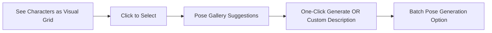

**Recommendation**: Visual character picker, pose suggestion gallery, batch option.

---

## 7. Audio Lab

### Purpose
Create and manage voice profiles for audio content.

### Current Flow
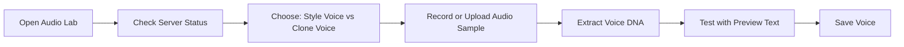

### UX Verdict: ⚠️ **Experimental Feel**
- **Strengths**: Dual mode (style vs clone), test preview option
- **Pain Points**:
  - Requires external voice server to be running
  - Server status check is manual
  - Recording interface lacks waveform visualization
  - Export Voice DNA creates complex file structure

### Ideal Flow
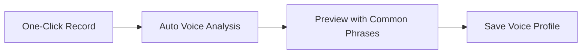

**Recommendation**: Serverless fallback, waveform UI, common phrase presets.

---

## 8. Library (My Files)

### Purpose
Central hub for all saved DNA and generated assets.

### Current Flow
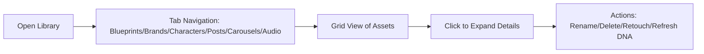

### UX Verdict: ⚠️ **Comprehensive but Dense**
- **Strengths**: All assets in one place, inline editing, DNA refresh
- **Pain Points**:
  - 6 tabs create visual overload
  - No search or filter
  - No favorites/pinning
  - Retouch workflow is hidden
  - Carousel individual slides not visible

### Ideal Flow
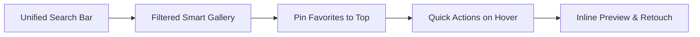

**Recommendation**: Search bar, favorites/pins, unified gallery with smart filters.

---

## Daily Creator Workflow Analysis

### Current "Post 1 Image" Journey
```
Home → Generator → Select Blueprint (scroll) → Select Brand → 
Enter Brief → Configure Settings → Wait → Review → Refine → 
Wait → Save → Home → Library to verify
```
**Total Steps: ~12** | **Total Screens: 3** | **Total Waits: 2-3**

### Ideal "Post 1 Image" Journey
```
Home → Quick Post Widget → Select Recent Preset → 
Enter Brief → Generate → One-Click Save
```
**Total Steps: ~5** | **Total Screens: 1** | **Total Waits: 1**

---

## High-Impact Recommendations

### 1. Add "Quick Post" Widget to Home
Place a prominent quick-action card that:
- Shows last 3 used presets
- Has inline brief input
- One-click generate

### 2. Implement Smart Defaults
- Remember last-used Blueprint, Brand, Character combination
- Auto-suggest aspect ratio based on blueprint type
- Default to "Strict" intensity

### 3. Reduce Screen Navigation
- Combine DNA selection into a collapsible sidebar
- Add "Generate Another" button after save
- Enable cross-feature shortcuts (e.g., "Save to Library" → "Open in Generator")

### 4. Add Regeneration & Variation
- "Regenerate" button that repeats with same settings
- "Create Variation" that slightly modifies the output
- Undo/redo for refinements

### 5. Implement Global Search
- Search across all DNA types
- Filter by tags, date, category
- Pin frequently-used assets

### 6. Add Scheduling Preview (Future)
- Calendar view of scheduled posts
- Integration with export for social platforms

---

## Summary Verdict by Feature

| Feature | Daily Use Score | Recommendation Priority |
|---------|-----------------|------------------------|
| Brand Lab | 3/5 | Low - Setup tool |
| Character Lab | 3/5 | Medium - Simplify upload |
| Design Builder | 3/5 | Medium - Auto-categorize |
| **Post Generator** | 2/5 | **High - Simplify modes** |
| Carousel Generator | 4/5 | Low - Working well |
| Character Studio | 3.5/5 | Medium - Add suggestions |
| Audio Lab | 2/5 | Low - Experimental |
| Library | 3/5 | High - Add search |

---

*This audit document provides actionable insights for improving the daily content creation workflow in Creative Powerhouse.*
